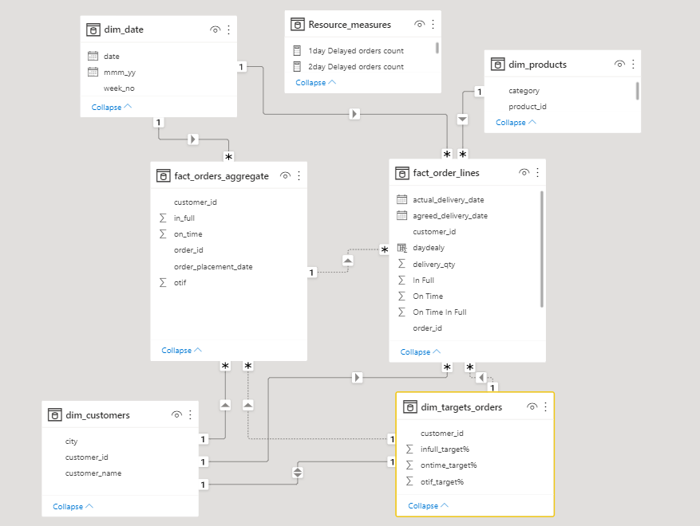

# 🚛 Optimizing Supply Chain for FMCG Growth  

## Data modeling

Welcome to the **FMCG Supply Chain Expansion** project!  
Scaling a fast-moving consumer goods business? Let's make it efficient! 📦📊  

## 🚨 The Problem  
A growing FMCG manufacturer in Gujarat is operational in **Surat, Ahmedabad, and Vadodara** but faces **supply chain bottlenecks** as they plan to expand to metro & tier-1 cities in the next 2 years. Inefficiencies in logistics and demand forecasting slow down growth. 😓  

📌 **Problem Statement:**  
How can we streamline supply chain operations to ensure a **smooth expansion** without stock issues or delays?  

## 🔍 My Approach  
I analyzed **sales data, logistics performance, and demand patterns** across existing cities. Using **predictive analytics and route optimization**, I identified key areas to improve supply chain efficiency.  

📌 **Pipeline & Strategy:**  
- 📍 **Location-based demand forecasting**  
- 🚛 **Optimized logistics & distribution routes**  
- 📦 **Inventory & warehouse efficiency improvements**  
- 💡 **Data-driven expansion planning**  

## 🎉 The Final Results  
Success! Now the client has:  
✅ **Faster deliveries & reduced logistics costs** 🚚  
✅ **Better inventory management & fewer stockouts** 📦  
✅ **Optimized expansion roadmap for new cities** 🏙️  
✅ **Higher customer satisfaction & increased sales** 💰  

---

## 🚀 Ready to scale your FMCG business?  
It’s time to optimize your supply chain and **expand smoothly!** 🚀  
Drop me a message:  

📩 **Email:** abdullahyonus616@gmail.com  
💬 **WhatsApp:** [+201122026970](https://wa.me/201122026970)  

Let’s make growth effortless! 🔥📊
